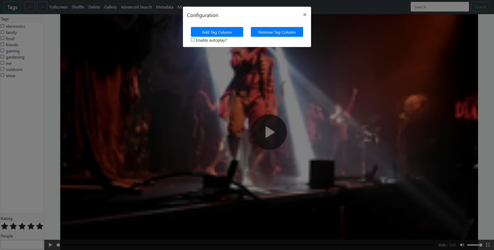

# Media viewer and organiser


## Features
* Web-based interface
* Video, gif and image support
* Tagging media
* Various forms of searching (weighted keyword, tag selection, etc)
* Metadata support for Artist/Album/Title/[People/Actors]
* Auto-scraped metadata from files where possible
* Internal image gallery for faster browser
* Thumbnail generation for all media
* Auto-transcode videos for web-browser compatibility
* Import and export database to JSON format
* Rating system

## Quick-Start
1) Install Docker CE (https://docs.docker.com/install)
2) ```git clone https://github.com/simplyboo6/Vimtur```
3) ```cd Vimtur```
2) Run ```DATA_DIR=/home/user/Pictures CACHE_DIR=/home/user/cache docker-compose up``` (change `DATA_DIR` and `CACHE_DIR`).

## Notes
* Requirements
  * ffmpeg for transcoding and thumbnails.
  * graphicsmagick for extracting EXIF data.
* Caching data takes a lot of space. All videos are re-transcoded to be h264 and HLS compatible.
* Because of pre-caching it's possible to quickly skip through videos and loading times are minimal.
* All videos are transcoded to a high-quality, if the source video is h264 it's just copied. Often this means h264 source videos are transcoded quickly but it also means a reasonably fast network is required.
* Tested on Ubuntu 16.04 & 18.04 64-bit and Windows 10 64-bit.
* The included compose file comes with a mongodb instance.
* The keyword search supports quotes ("magic phrase" for sentences and negation (-) on words and sentences).

## Docker
The server can be run as a Docker instance. It accepts the following environment variables:
* (required) DATA_DIR - The path to the media library.
* (required) CACHE_DIR - The directory to cache thumbnails, videos, and store the config and database. Cannot be inside the DATA_DIR.
* (optional) CONFIG_PATH - The location of config.json, by default this will be in `${CACHE_PATH}/config.json`.
* (optional) USERNAME - A username to login with. PASSWORD also required.
* (optional) PASSWORD - A password to login with. USERNAME required too.
* (optional) PORT - A port for the Docker instance to expose. Default 3523.
* (optional) DATABASE - Must be set to `mongodb` (default).
  * If using `mongodb` then you must also set `MONGO_HOST` and `MONGO_DATABASE`. If they're set in your config.json file then the DATABASE config can be omitted. Optional: `MONGO_USERNAME`, `MONGO_PASSWORD`, and `MONGO_PORT`.

Note: Any of these variables can be used when starting the NodeJS app natively.


## Example
### Basic
```DATA_DIR=/home/user/Pictures CACHE_DIR=/home/user/cache docker-compose up```
### External MongoDB (make sure to modify docker-compose.yml.
```DATA_DIR=/home/user/Pictures CACHE_DIR=/home/user/cache DATABASE=mongodb MONGO_HOST=localhost MONGO_DATABASE=photos MONGO_USERNAME=username MONGO_PASSWORD=password docker-compose up```

## Running Natively
### Setup
On Ubuntu/Debian run:
`sudo apt-get install graphicsmagick ffmpeg`

For Windows install graphicsmagick, ffmpeg and ffprobe. Make sure they're in your `PATH` variable.

`yarn install && yarn start`

### Running
Specifying a path as the last argument when doing any launch will set the config to be used by the instance.
Such as: `yarn start /data/Pictures/config.json`. It's also possible to set `CONFIG_PATH` or `DATA_DIR` and `CACHE_DIR` as specified under the Docker section instead.

## Screenshots
### Admin

### Metadata

### Search

### Configuration

